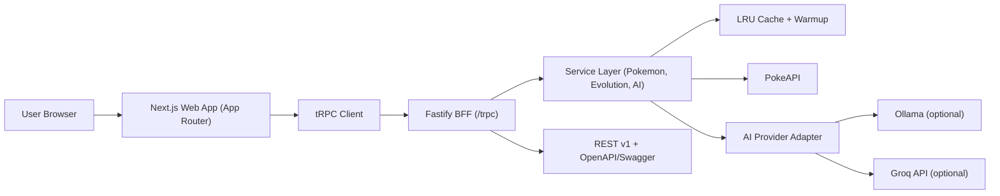

# Pokedex

## Overview
Pokedex is a responsive Pokemon explorer built as a TypeScript monorepo with a dedicated Backend-for-Frontend.
The web app renders a Game Boy Advance-inspired interface with fast list navigation, inline detail views, and evolution-aware search.
All Pokemon data is brokered through a typed API layer (tRPC + Zod), with caching and warm-up strategies to reduce latency.
The project supports AI-generated fun facts with three runtime modes: disabled, local Ollama, or Groq API.
The architecture is deployment-ready with Docker, Compose profiles, and environment-driven runtime configuration.

## Architecture (High Level)
The solution is structured as a monorepo with a clear separation between UI, shared contracts, and backend orchestration.
The Next.js app is responsible for rendering and interaction, while all external data access is delegated to a Fastify-based BFF.
The BFF exposes typed tRPC procedures (and REST/OpenAPI endpoints), validates payloads with Zod, and normalizes PokeAPI responses.
Domain services encapsulate list, detail, evolution, and AI enrichment logic to keep transport and business concerns decoupled.
Caching and startup warm-up reduce repeated upstream calls and improve perceived latency for common queries.
An AI provider adapter selects between deterministic fallback, local Ollama, or Groq through environment-driven configuration.
This keeps the frontend simple, strongly typed, and isolated from provider-specific behavior or third-party API volatility.



### Stack

| Layer | Technology |
|---|---|
| Web | Next.js, React, Tailwind CSS, Zustand, next-intl |
| BFF | Fastify, tRPC, Zod, LRU cache |
| Shared contracts | `packages/shared` (TypeScript + Zod) |
| Infra | Docker multi-stage builds + Docker Compose profiles |

## Product Capabilities (Client-Facing Milestones)

- GBA-style responsive UX for desktop, tablet, and mobile.
- Real-time Pokemon exploration with list sorted by ID.
- Multi-filter support by generation and multi-type intersection.
- Evolution-aware live search (matching chain members, not only direct name hits).
- Inline detail mode inside the same screen with stats, evolutions, and AI fun facts.
- Multi-language interface (EN, ES, IT, PT, DE) with localized labels and detail content.
- Theme personalization with multiple GBA shell colors and persisted preferences.
- Local-first/Cloud AI runtime options:
  - deterministic fallback (no AI),
  - host Ollama integration,
  - Groq API integration.
- URL-based state persistence for filters/search during navigation.
- End-to-end typed contracts across frontend, BFF, and shared schemas.

## Run Instructions

### 1) Prerequisites

- Docker + Docker Compose
- Optional for host AI mode: [Ollama](https://ollama.com/download)
- Optional for Groq mode: `GROQ_API_KEY`

### 2) Environment Setup

```bash
cp .env.example .env
```

Set secrets when needed:

```bash
# only required for Groq mode
GROQ_API_KEY=your_secret_here
```

### 3) Docker Compose Profiles

Profile behavior:

- `groq` (default): API uses Groq provider.
- `ollama`: API targets Ollama endpoint.
- `none`: AI disabled, deterministic fallback.

Run with explicit profiles:

```bash
docker compose --profile groq up --build
docker compose --profile ollama up --build
AI_PROVIDER=none docker compose --profile none up --build
```

Default run (uses `.env` defaults, usually `groq`):

```bash
docker compose up --build
```

### 4) Helper Script (Recommended)

Start/stop via unified script:

```bash
./scripts/pokedex-stack.sh up --ai groq
./scripts/pokedex-stack.sh up --ai ollama
./scripts/pokedex-stack.sh up --ai none
./scripts/pokedex-stack.sh down --ai groq
```

#### Ollama Script Modes

- `--ai ollama` (or `--ai host`) starts stack configured for host Ollama.
- `--model` sets Ollama model in Ollama mode.

Examples:

```bash
./scripts/pokedex-stack.sh up --ai ollama --model phi3:mini
./scripts/pokedex-stack.sh up --ai host --model qwen2:0.5b
```

### 5) URLs

- Web: `http://localhost:3000`
- API health: `http://localhost:4000/health`
- OpenAPI: `http://localhost:4000/openapi/v1.json`
- Swagger UI: `http://localhost:4000/docs`

## Testing

```bash
pnpm test
pnpm test:coverage
pnpm test:e2e
pnpm test:a11y
pnpm test:perf:smoke
```

## Changelog

See `/CHANGELOG.md` for release history.
